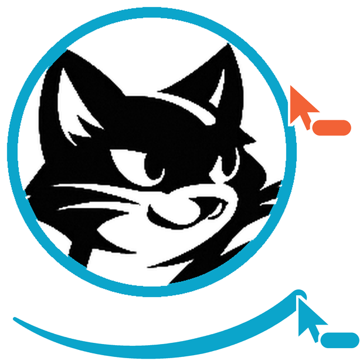
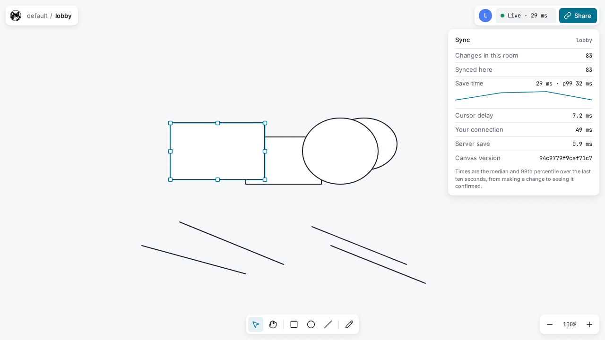

<p align="center">
  
</p>

<h1 align="center">Felix Canvas</h1>

<p align="center">
  A self-hosted multiplayer drawing canvas whose entire backend is <a href="https://github.com/gabloe/felix">Felix</a>.<br>
  No Postgres, Redis or Kafka beside it.
</p>

<p align="center">
  <a href="https://github.com/gabloe/felix-canvas/actions/workflows/ci.yml"></a>
  <a href="LICENSE"></a>
</p>

<picture>
  <source media="(prefers-color-scheme: dark)" srcset="docs/screenshots/sync-dark.png">
  
</picture>

Shapes, cursors, presence, history and snapshots all live in Felix streams and
caches. You run it yourself: Felix, a stateless gateway, a snapshotter and the web app.

**Status: M0 to M6 done.** Two browsers draw rectangles, ellipses, lines and pen
strokes in one room and drag the same shape at once. Each one's canvas is a fold
of the room's Felix log in offset order, and both end with the same state hash.
A snapshotter keeps the room's folded state in the Felix cache, so a browser
joining a busy room draws it at once and reads only the recent changes.
Everyone sees everyone else's cursor and name, and a member list that drops a
closed laptop on its own. People sign in with your identity provider, and each
session can reach only the room it opened, enforced by Felix itself.
A tab throttled to 100 kbit/s falls behind alone, says so, and catches up to
the same canvas while everyone else stays live. History mode scrubs a room
back and forth through every change it has had, straight from the log, and
returns to live without missing anything.
Packaged images for self-hosting come in M8; until then, see
[Running locally](#running-locally).

## Why it exists

A broker does not argue for itself. Felix can publish at 181 µs p50 over a real
network and hold a publisher's acknowledgement flat while fanning out to 500
subscribers, but those are rows in a table until something uses them.

Felix Canvas is the application that makes them visible:

- **Fanout.** One publish is encoded once and shared with every viewer. Felix
  delivers over a million messages a second to 500 subscribers on one broker
  with nothing dropped, and the publisher's acknowledgement holds flat at 206 µs.
- **Isolation.** A deliberately throttled client loses frames loudly and
  rebuilds from its last offset, while everyone else is undisturbed.
- **Replay.** The log *is* the document, so you can scrub a room backwards
  through its own history. No server-side session state to replay from.

## How these are normally built

A realtime canvas is normally four systems: a WebSocket tier with sticky sessions
so a room's clients reach the process holding it, Redis pub/sub to fan out when
they do not, Postgres for the document of record, and Kafka added later when
history turns out to matter. That stack works, and most collaborative software you
have used is built from it, but the order of truth is split across all four, and
Redis pub/sub carries no offsets, so a client that misses an update has no way to
learn that it did. Reloading the page is collaborative software's universal
repair for exactly that reason.

Felix Canvas keeps the merge rule those systems already use (last-writer-wins
per shape field, the same rule as Figma) and changes only what sits underneath.
One log per room does the live fanout *and* the history, so catch-up and replay
are the same call, and a missed update is a gap in offsets rather than a wrong
picture nobody notices.

The design chapter [How these are normally built](docs/design.md#how-these-are-normally-built)
has the full comparison, including what the trade costs: a gateway hop for
browsers, no place to keep an ACL, and no offline editing worth the name.

## How it works

One room is one durable Felix stream plus a few cache keys.

| What | Felix primitive | Name |
|---|---|---|
| Edit operations | Durable stream | `canvas.ops.<room>` |
| Cursors and presence | Ephemeral stream | `canvas.presence.<room>` |
| Compacted snapshot + its log offset | Cache key | `canvas.snap.<room>/latest` |
| Who is in the room now | Cache keys with TTL | `canvas.members.<room>/<session>` |
| Who may open the room | Felix RBAC role | `role:room-<room>` |
| Snapshot worker cursor | Consumer group | group `snapshotter` |

Edits and presence are separate streams because they have opposite
requirements: an edit must never be dropped, and a cursor position from 40 ms
ago is worthless. The edit stream is durable; the presence stream runs in memory
with a drop-new overflow policy.

Room state is a pure fold over the op stream, so two clients that have applied
the same prefix hold the same canvas, which is checkable with a hash rather
than by eye.

See [docs/design.md](docs/design.md) for the full design: join and snapshot
ordering, conflict resolution, failure modes, the browser transport problem, and
the milestone plan.

## Build order

| M | Milestone | Proves | Status |
|---|---|---|---|
| 0 | WebSocket gateway relaying publish/subscribe | A browser can reach Felix at all | Done |
| 1 | Two browsers, shapes, offset-ordered apply | The log is the document | Done |
| 2 | Snapshotter and the join path | A cold client joins a busy room correctly | Done |
| 3 | Presence, cursors, TTL membership | The ephemeral/durable split is real | Done |
| 4 | Slow-client lane and offset-gap recovery | Isolation and correct rejoin | Done |
| 5 | Time scrubber over the op log | Replay, with no state hiding in the gateway | Done |
| 6 | Per-room token narrowing against a real IdP | Multi-tenancy enforced by the broker | Done |
| 7 | 500-viewer stress; kill the owning broker | Flat fanout and survival of failover | |
| 8 | Images, a compose install, your own IdP, a Helm chart | Anyone can self-host it | |

Each milestone is tracked as a [GitHub milestone](https://github.com/gabloe/felix-canvas/milestones)
with an issue per piece of work.

M0 comes first because Felix is QUIC end to end, and the gateway is what brings
a browser onto that path. What it proves, as tested in CI against the published
Felix images:

- Two WebSocket sessions publish to `canvas.ops.lobby` and both receive all ten
  records in one order, with increasing log offsets, each session's own records
  in the order it sent them.
- An ack carries the same offset the record is delivered at, and subscribing
  from an offset replays the log from there.
- The presence stream relays without offsets, fire-and-forget.
- The gateway reports its browser leg and its Felix leg as separate latency
  histograms.

M1 makes the log the document. What it proves, in CI against the same images:

- Two browsers draw in one room, each sees the other's shapes, and both drag one
  rectangle at the same time. Once neither has an edit in flight, both have
  applied the same log prefix and their state hashes match.
- A third browser that joins afterwards replays the log from offset 0 and
  reaches the same hash.
- Unit tests show that the fold converges under concurrent writes to one field
  and to different fields, and that records delivered out of order and twice
  end in the same state as in-order delivery.
- Each session's sequence numbers come from the Felix counter
  `canvas.seq.<room>/<session>`, reserved through the gateway.

M2 makes joining cheap. What it proves, in CI against the same images:

- The snapshotter reads the op log through the consumer group `snapshotter`,
  folds it with the same `model/` code as the browser, and writes the state and
  its offset as one value to `canvas.snap.<room>`. It acknowledges records only
  after the write, and unit tests show a crash between writes ends in the same
  snapshot.
- A browser subscribes at the live tail before it reads the snapshot. A unit
  test publishes while the snapshot read is in flight and checks that the
  change arrives on the live subscription, with no second read of the log, and
  an integration test checks the same against Felix.
- A browser whose place in the log has been trimmed rebuilds from the snapshot
  through the same code path and keeps its unsaved edits.
- A cold browser joining a room of 10,000 ops while another session edits draws
  its first correct frame in under 500 ms and ends with the same state hash as a
  browser that saw every op live.

M3 splits what must last from what must be fast. What it proves, in CI against
the same images:

- Two browsers see each other's cursors follow the pointer, with names, through
  the in-memory presence stream. Each browser sends at most one cursor message a
  frame, fire-and-forget; unit tests pin the pacing down.
- Each session keeps a member entry, `canvas.members.<room>/<session>`, with a
  30 second TTL that it refreshes every 10 seconds. Browsers read the list
  through one retained prefix watch. A tab that closes deletes its entry at
  once; a tab that crashes drops out of the other browser's list when the
  entry expires, not before.
- A person keeps their colour and shows once in the list across a reload,
  because colours come from an id the browser keeps, not from the session.
- The gateway lists, watches and expires member entries against a real broker.

M4 shows that a slow client hurts only itself. What it proves, in CI against
the same images:

- The Sync panel's "Slow connection" switch has the gateway read that tab's
  subscriptions at 100 kbit/s. Felix's bounded queue for that subscriber drops
  new changes; the gateway drops nothing.
- The browser treats a jump in offsets as a loss, shows "Your connection is
  slow" with a count, reads the missing changes from the log, and ends with the
  same state hash as the other browsers. A loss at the very end of a burst,
  which no later change reveals, is caught from the applied count peers send
  with their presence.
- With one of three browsers throttled under 300 changes a second, the others'
  save time stays under 50 ms at the median and within 1.5 times plus 10 ms of
  what it was without the throttled browser.
- A gateway integration test shows a throttled connection seeing a gap while
  another connection on the same gateway receives every record.

M5 makes history a fold of the log. What it proves, in CI against the same
images:

- History mode reads the room's log from offset 0 over a second gateway
  connection, narrowed to the room like the first, and the gateway keeps
  nothing about it. The live session keeps running, so going back to live
  shows the changes made meanwhile.
- On a 10,000-change room, a browser drags the playhead back and forth, and at
  every stop the canvas has the same state hash as a fresh fold of the log to
  that change. History loads within 0.5 ms per change and the slowest seek
  stays under 50 ms; both measure several times lower.
- A unit test checks every position of a 3,000-op log, in any order, against a
  fresh fold, including a history that starts at a snapshot because retention
  trimmed the log below it.
- The scrubber reaches as far back as the log does. Felix keeps logs unless a
  broker-wide limit is set, so that is the room's first change by default
  ([design.md](docs/design.md#how-far-back-the-scrubber-reaches)).

M6 puts each session in one room and lets Felix keep it there. What it proves,
in CI against the same images:

- The browser signs in with the authorization code flow and PKCE, and joins a
  room with its ID token. The gateway exchanges that token at the Felix control
  plane for a Felix token narrowed to the room's two streams and three caches,
  and opens that session's own Felix connection with it.
- Who may open a room is a Felix RBAC role per room, so the control plane
  refuses the exchange for anyone else. A refused browser shows "You don't have
  access to this canvas" with a way to switch account.
- A token for the lobby, held by someone who may also open the studio, is
  refused by the broker when it publishes to, subscribes to, reads or writes
  anything of the studio's. The test talks to the broker directly, and fails if
  the gateway stops narrowing.

## Repository layout

| Path | What |
|---|---|
| `gateway/` | The edge gateway: Rust, `axum` and `felix-client`. Stateless; it relays bytes |
| `model/` | The op schema, its MessagePack encoding, the fold, the snapshot format and the state hash, shared by the browser and the snapshotter |
| `snapshotter/` | Node service: reads a room's log through a consumer group with the `felix-client` npm package and keeps its snapshot in the cache |
| `web/` | The browser client: Canvas2D renderer, tools, the op pipeline and join path, and the Playwright tests |
| `dev/` | Felix for local runs and CI: Docker Compose over the published images, a stand-in IdP, and a seed script |
| `docs/design.md` | The design: data model, editing and join rules, failure modes, targets |
| `docs/protocol.md` | The browser to gateway protocol |
| `docs/ux.md` | The UX and visual design brief the interface is built from |
| `docs/development.md` | Where to run it, the lockfile rule, the dev stack and CI |
| `docs/brand/` | The Felix Canvas mark, adapted from the Felix logo |
| `CONTRIBUTING.md` | How code, comments and pull requests should read |

## Running locally

You need Docker, Rust (the toolchain in `rust-toolchain.toml` installs itself),
and Node 24.

1. Start Felix. This pulls `ghcr.io/gabloe/felix-broker` and
   `felix-controlplane` at `0.6.0-preview`, starts a stand-in sign-in service on
   `127.0.0.1:9400`, creates the `lobby` and `studio` rooms, and writes the
   snapshotter's token and the broker's certificate to `dev/state/`:

   ```bash
   dev/up.sh
   ```

   Each run starts from an empty log. `docker compose -f dev/docker-compose.yml down -v`
   stops it.

2. Start the gateway, which listens on `127.0.0.1:8787`. It has no token of its
   own; each browser's sign-in is exchanged for one when it joins:

   ```bash
   export CANVAS_FELIX_CA_FILE=dev/state/broker-cert.pem
   cargo run -p felix-canvas-gateway
   ```

3. In another shell, build the shared model and start the snapshotter, which
   answers on `127.0.0.1:8788` with how far it has got:

   ```bash
   npm install
   npm run build -w @felix-canvas/model -w @felix-canvas/snapshotter
   export CANVAS_FELIX_TOKEN="$(cat dev/state/snapshotter.token)"
   export CANVAS_FELIX_CA_FILE="$PWD/dev/state/broker-cert.pem"
   npm start -w @felix-canvas/snapshotter
   ```

4. In another shell, start the page, which proxies the gateway's routes:

   ```bash
   npm run dev -w @felix-canvas/web
   ```

5. Open <http://localhost:5173> in two windows, continue as `ana` or `ben`, and
   draw: <kbd>R</kbd> for a rectangle, <kbd>O</kbd> an ellipse, <kbd>L</kbd> a
   line, <kbd>P</kbd> the pen, <kbd>V</kbd> to select and drag, and <kbd>?</kbd>
   for every shortcut. The chip at the top right shows how long your changes
   take to save; click it for the sync details, including the canvas version
   both windows should share. `?room=studio` opens the other room, which only
   `ana` may open.

`curl -s 127.0.0.1:8787/metrics` shows the latency of both legs. With the variable
from step 2 exported, the integration tests run against the same stack:

```bash
cargo test -- --include-ignored
```

The browser tests start their own gateway, snapshotter and page against the
running stack:

```bash
npx -w @felix-canvas/web playwright install chromium
npm run test:e2e -w @felix-canvas/web
```

[docs/development.md](docs/development.md#the-felix-dev-stack) lists every
variable the gateway and the snapshotter read.

## Signing in with your own identity provider

Felix Canvas signs people in with any OpenID Connect provider (Entra ID, Okta,
Auth0, Google, Keycloak and others), and Felix decides who may open which room.
Packaging for self-hosting comes in M8; these are the settings it will expose.

**At the provider**, register a single-page application (a public client):

| Setting | Value |
|---|---|
| Grant | Authorization code with PKCE (S256); no client secret |
| Redirect URI | The canvas's origin with a trailing slash, such as `https://canvas.example.com/` |
| Scopes | `openid profile` |
| Allowed origins (CORS) | The canvas's origin, for discovery and the token endpoint |

**On the gateway:**

| Variable | Value |
|---|---|
| `CANVAS_OIDC_ISSUER` | The provider's issuer URL, exactly as it appears in the ID token's `iss` |
| `CANVAS_OIDC_CLIENT_ID` | The client ID from the registration |
| `CANVAS_FELIX_CONTROL_PLANE` | The Felix control plane's URL |
| `CANVAS_TENANT`, `CANVAS_NAMESPACE` | Where the rooms live in Felix |

**In Felix**, the tenant trusts the provider through an entry in its
`idp_issuers` (at bootstrap, or later with `tenant.manage`):

| Field | Value |
|---|---|
| `issuer` | The same issuer URL |
| `audiences` | `[<client ID>]`, since an ID token's audience is the client |
| `jwks_url` or `discovery_url` | Where the provider publishes its signing keys |
| `claim_mappings` | `{"subject_claim": "sub", "groups_claim": "groups"}`; the groups claim only if rooms are granted to groups |

Felix accepts only ES256 ID tokens by default. Entra ID, Okta and Auth0 sign
with RS256, so set `FELIX_CONTROLPLANE_OIDC_ALLOWED_ALGORITHMS=ES256,RS256` on
the control plane for them.

**Each room** needs its streams, its caches and a role. For a room `r` in
tenant `t` and namespace `n`:

- streams `canvas.ops.r` (durable) and `canvas.presence.r` (in memory), one shard each;
- caches `canvas.seq.r`, `canvas.snap.r` and `canvas.members.r`, one shard each;
- a role `role:room-r` granted `stream.publish` and `stream.subscribe` on both
  streams, `cache.write` on `cache:t/n/canvas.seq.r`, `cache.read` on
  `cache:t/n/canvas.snap.r`, and `cache.read` and `cache.write` on
  `cache:t/n/canvas.members.r`.

Members are whoever holds the role: assign it to a person by Felix principal
(the hex SHA-256 of `<issuer>|<subject>`), or to a provider group as
`group:<issuer>#<group>` to manage rooms in your directory. Removing someone
takes effect at their session's next token refresh. [`dev/seed.mjs`](dev/seed.mjs)
does all of this for the development stack, and
[design.md](docs/design.md#authorization) explains the model.

## License

MIT
