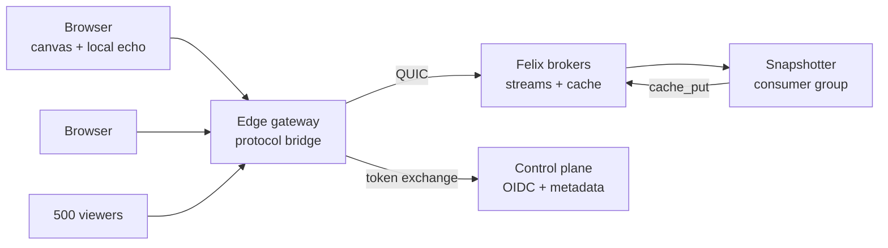
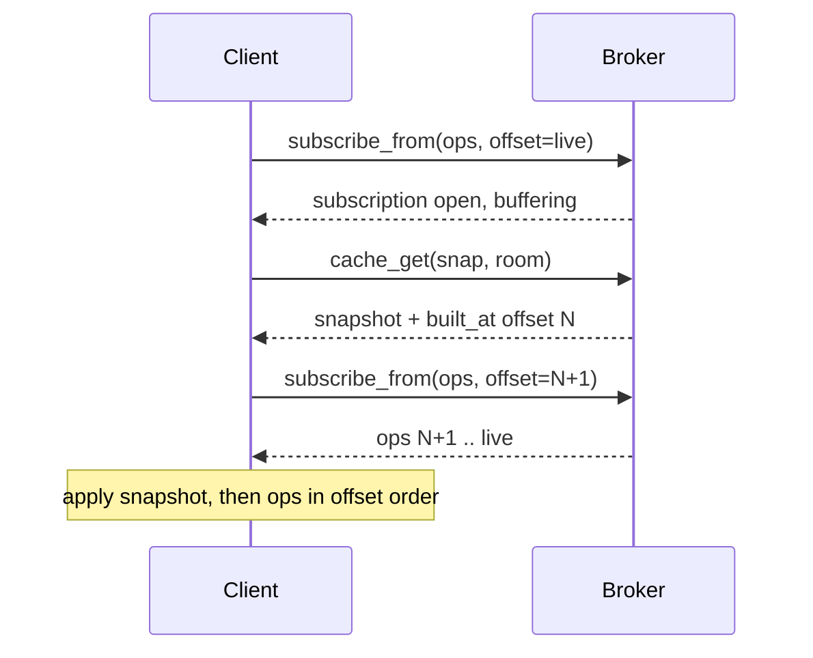

# Felix Canvas design

A multiplayer drawing canvas whose entire backend is [Felix](https://github.com/gabloe/felix):
shapes, cursors, presence, history and snapshots in Felix streams and caches,
reached over one authenticated QUIC connection.

It exists to argue something a broker alone cannot: that cheap fanout,
per-subscriber isolation and replay-by-offset are product features, not
benchmark rows. The audience is an engineer who would otherwise wire Redis
beside Kafka and does not yet believe one system covers both.

How it looks and feels is in the UX and visual design brief, [ux.md](ux.md).

**In scope**

- Freeform shapes on an infinite canvas: rectangle, ellipse, line, pen stroke, text, image placeholder
- Live cursors, selections and presence for everyone in a room
- Durable document history with replay and a time scrubber
- Multi-tenant rooms behind the user's own IdP
- A deliberate slow-client lane, because the isolation property is only convincing when you can watch it work

**Out of scope**

- Rich text editing inside shapes beyond a single-line label: the conflict story there is a research project, not a Felix story
- Offline-first editing with weeks of divergence; the design assumes a client reconnects within the retention window
- Permissions finer than room-level (see Authorization for why, and what it would cost)
- Anything that needs a second datastore. If a feature cannot be expressed in streams, caches and counters, it is out by definition

## Success criteria

The project succeeds if five demonstrations work in front of a skeptic.

| # | Demonstration | Passes when |
|---|---|---|
| 1 | Flat fanout | 500 connected viewers on one room; the drawing client's publish-to-ack p50 stays within 15% of the same measurement with 1 viewer |
| 2 | Slow client isolation | One viewer throttled to 100 kbit/s; the other 499 show no added latency, and the throttled one reports its own loss rather than stalling anyone |
| 3 | Correct rejoin | The throttled viewer reconnects and its canvas converges to byte-identical shape state, verified by comparing a content hash against another client |
| 4 | Replay | Scrub a 10,000-op document backwards and forwards; every intermediate frame is reproducible from the log alone, with no server-side session state |
| 5 | Survive broker loss | Kill the broker owning the room's stream mid-stroke; editing resumes on the new owner with no lost acknowledged op and no duplicate op |

Two criteria are deliberately absent. Raw message rate is not a goal: a canvas
will never push millions of messages a second, and claiming it as a product
number would be dishonest. Nor is scale in rooms: one broker holding one busy
room is the interesting case, since a stream shard has a single owner.

## How these are normally built

Nothing in this design is a new idea about collaborative editing. The merge rule
below is the one Figma already uses. What is unusual is the layer underneath it,
so it is worth being precise about what that layer normally is.

Three shapes dominate, and they differ mostly in where the merge happens:

| Shape | Merge runs | Examples | The server is |
|---|---|---|---|
| Authoritative document process | On the server, over a total order it defines | Google Docs (OT), Figma (LWW per property) | A stateful process owning one document in memory |
| CRDT plus a relay | In every client, independently | Yjs with `y-websocket`, Automerge, PartyKit | A relay that also persists, still usually one room per process |
| Managed realtime service | Wherever the vendor put it | Firebase, Supabase Realtime, Liveblocks, Ably | Someone else's problem, at someone else's price |

Self-hosted, the first two assemble from roughly the same parts:

- **A WebSocket tier** terminating browsers, with **sticky routing** so every client in a room reaches the process holding it.
- **Redis pub/sub or NATS** to fan a room's updates across that tier when they do not.
- **Postgres or object storage** for the document of record and its snapshots.
- **Kafka**, eventually, when history or audit turns out to be a requirement after all.
- **A separate presence path**, usually Redis keys with a TTL, kept away from the durable one because cursors at 60 Hz would swamp it.

That stack works. Most of the collaborative software you have used is built from
it. Its seams are in known places:

**The order of truth is split across systems.** Redis has one order, Postgres
another, Kafka a third, and none of them is defined relative to the others. On
reconnect, which one should the client believe? The common answer is none of
them: refetch the whole document.

**A drop is invisible.** Redis pub/sub is at-most-once and carries no offsets.
When a relay's per-client buffer fills it drops, and the client has no way to
learn that it did. A canvas that missed one op renders a wrong picture and never
finds out. This is the failure the usual stack handles worst, and it is why
reloading the page is collaborative software's universal repair.

**Live and historical are different code paths.** The live path is a socket, the
history path is a table or a topic. Replay, time travel and "catch me up from
where I was" get written twice, against two sources that can disagree.

**The relay is stateful, which makes it a liability.** A document lives in one
process's memory, so the application inherits sticky sessions, rehydration on
every deploy, and a placement problem of its own to solve.

**Fanout is billed per connection.** A relay that serializes once per client pays
500× for 500 viewers, which is why viewer-heavy rooms are where these systems
first get expensive.

### What changes when the substrate is a log

This design keeps the merge rule and replaces what sits under it: one durable
stream per room, one ephemeral stream for cursors, one cache key for snapshots.
The seams above stop being application work and become properties of the broker.

| Seam | Usual stack | Here |
|---|---|---|
| Order of truth | Split across Redis, Postgres, Kafka | One shard, one offset sequence, no second opinion |
| Drop detection | Silent | A gap in offsets, which is an error the client recovers from |
| Catch-up vs. history | Two paths, two sources | `subscribe_from(offset)`, the same call for both |
| Slow client | A buffer policy hand-written in the relay | A bounded per-subscriber queue with a declared overflow policy |
| Fanout cost | Encode per connection | Encoded once, shared by every subscriber |
| Relay state | Owns the room | Owns a socket; no sticky routing, nothing to rehydrate |
| Failover | Application-level document placement | Shard ownership under a lease, already the broker's job |

The claim is not that a log is a novel way to hold a document; event sourcing
predates all of this. It is that *the same log* is doing the live fanout, so the
two things that normally live in separate systems, and disagree, share one
structure and one order.

**What it costs.** The trade is real and runs in both directions:

- **A browser cannot speak QUIC to Felix**, so this design pays for a gateway hop that anyone using `y-websocket` does not.
- **Felix is not a database.** No object ACLs, no queries, no transactions, which is why room membership has no obvious home (see Authorization).
- **One room is one shard is one owning broker**, the same single-owner constraint as a per-document server process. The difference is that failover is machinery Felix already has rather than something this application invents.
- **Delivery is at-least-once**, so clients must dedupe; a CRDT stack gets idempotence from the merge function for free.
- **Offline editing for weeks is out.** CRDTs win that outright, and this design does not compete for it.
- **Replay is bounded by retention.** A history that must reach back further needs checkpoints the log alone does not provide.

## Architecture

Exactly one new process type sits between a browser and Felix: an edge gateway
that terminates the browser's connection and speaks Felix's QUIC protocol on the
other side. Everything else is Felix or a browser.

The gateway holds no canvas state. It owns a browser socket, an attenuated Felix
token and a Felix connection, and it copies frames between them; a room's truth
lives only in the broker's log and cache. That constraint is what keeps
demonstration 4 honest: if the gateway cached shapes, replay would be proving
the gateway works, not the log.

| Component | Language | Holds state? | Responsibility |
|---|---|---|---|
| Canvas client | TypeScript + Canvas2D/WebGL | Yes, a local replica | Render, generate ops, optimistic echo, reconcile on ack |
| Edge gateway | Rust, `felix-client` | No | Browser transport, token exchange and attenuation, frame relay |
| Brokers | Felix | Yes, authoritative | Op log per room, snapshot cache, presence, group cursors |
| Control plane | Felix | Yes, metadata | Token exchange against the IdP, tenant/stream registration |
| Snapshotter | TypeScript on Node, `felix-client` from npm | No | Reads the op log as a consumer group, writes compacted snapshots |

The canvas client and the snapshotter share the op schema, its encoding and
the fold through the `model/` package, so the state a browser renders and the
state a snapshot stores come from the same code.

The gateway is Rust because it never needs that code. It relays bytes, so the
language boundary keeps it from growing canvas logic, and it can move into Felix
later as a first-party browser bridge built on `felix-client`. It also fans out
to many sessions without a JavaScript round trip per event.

The snapshotter is a separate process on purpose. Snapshot writes are throughput
work and must never share a fate with an interactive socket, and running it as a
consumer group gives it redelivery and dead-lettering for free.

## Data model

Everything is scoped `(tenant, namespace, name)`, which maps cleanly onto the
product: tenant is the customer, namespace is the workspace, and the last
segment names a room.

| What | Felix primitive | Name | Durability |
|---|---|---|---|
| Edit operations | Durable stream | `canvas.ops.<room>` | Log-backed, retained 30 days |
| Cursors and presence | Ephemeral stream | `canvas.presence.<room>` | None, at-most-once by design |
| Compacted snapshot | Cache key | `canvas.snap` / `<room>` | Log-backed, survives restart |
| Snapshot's log position | Same cache value | stored inside the snapshot record | Written atomically with the snapshot |
| Room membership | Cache keys with TTL | `canvas.presence` / `<room>:<session>` | TTL 30 s, refreshed by heartbeat |
| Op sequence per session | Counter | `canvas.seq` / `<room>:<session>` | Log-backed |
| Snapshot worker cursor | Consumer group | group `snapshotter` | Replicated with the shard |

**Edits and presence are separate streams.** They have opposite requirements: an
edit must never be dropped, a cursor position from 40 ms ago is worthless.
Splitting them lets the edit stream run with durability and the presence stream
run in memory with `DropNew`, so a backed-up cursor feed cannot consume queue
space an edit needs.

**One room is one shard, deliberately.** Felix shards a stream across owners and
orders records within a shard, not across them. A canvas wants one total order
per room, so a room maps to a single shard and therefore a single owning broker.
Rooms spread across the cluster by name; one room does not.

The snapshot value is a single record holding both the serialized shape set and
the log offset it was built from. Keeping them in one value is the whole trick
behind the join path: a reader cannot observe a snapshot without also learning
exactly where in the log it stops.

## Editing model

The log is the document. A room's state is a pure fold over its op stream, so
any two clients that have applied the same prefix hold the same canvas.

**What Felix gives you, exactly.** Records in one shard get offsets in the order
the broker admits them, and delivered events carry those offsets. Ordering is
guaranteed per publisher path, and the log offset is the authority when two
publishers race. Delivery is at-least-once on a durable stream, and Felix is
explicit that it offers no exactly-once, so the client must tolerate a repeat.

**What the client owes:**

1. Apply ops in offset order, never in arrival order. Buffer anything that arrives ahead of the next expected offset.
2. Deduplicate on `(session_id, seq)` carried in the op body, because a retried publish can land twice. A session's ops reach the log in `seq` order, since the gateway publishes a connection's ops one at a time and seqs come from a counter that only grows, so the fold keeps only each session's highest applied `seq` and ignores anything at or below it.
3. Make every op commutative or offset-ordered, since two clients can have ops admitted between each other's.

**Conflict resolution: last-writer-wins per shape field, keyed on log offset.**
Each op names a shape id and a sparse set of fields. Concurrent edits to
different fields of one shape both survive; concurrent edits to the same field
resolve to the higher offset. No vector clocks and no CRDT library.

That choice is defensible because a canvas has no text-insertion problem:
shapes are a map, not a sequence, and maps under LWW converge trivially. The two
places it shows its limits are z-order, which uses fractional indexing between
neighbours, and freehand strokes, which are immutable once finished and so never
conflict at all.

Op shape, MessagePack-encoded, roughly 60–120 bytes for a typical move:

| Field | Type | Purpose |
|---|---|---|
| `sid` | u64 | Session that authored the op, for dedupe and echo suppression |
| `seq` | u32 | Per-session counter, monotonic, for dedupe |
| `shape` | u128 | Target shape id, client-generated |
| `kind` | enum | `create` / `patch` / `delete` |
| `fields` | map | Only the changed fields |

Echo suppression matters more than it looks. A client applies its own op
optimistically, then sees it again from the broker. The client keeps its
unacknowledged ops as a pending list drawn on top of the fold of the log, so a
field with a local write shows that write whatever arrives for it meanwhile,
which is Figma's rule. When its own op comes back, matched on `(sid, seq)`, the
op leaves the pending list and enters the fold at its offset, which is how the
replica learns its own position in the log. The value on screen does not change,
because every write that reached the log before it had a lower offset.

## Join and snapshot

The rule is **subscribe before you read**. Registering the live subscription
first means any op published during the snapshot fetch is already queued for this
client; reading the snapshot first would lose exactly those ops. This is not
hypothetical: it is the same ordering defect Felix's own broker was written to
avoid, and it reappears in every application built on top.

The practical form is simpler than the diagram suggests: open the subscription at
the live tail, fetch the snapshot, then discard buffered ops at or below the
snapshot's offset and apply the rest.

**Snapshot production.** The snapshotter reads `canvas.ops.<room>` through a
consumer group, folds ops into its replica, and every 500 ops or 30 seconds
writes the serialized state plus the last applied offset to the cache. It acks
only after the `cache_put` returns, so a crash redelivers the window rather than
losing it. Rewriting the same key is idempotent, which makes at-least-once
redelivery harmless here.

**Why not ask a peer for state.** Peer-to-peer state transfer would make
correctness depend on which client answered, and that client's own replica might
be behind. The snapshot's authority comes from being derived from the log at a
named offset, by a process that has no other job.

## Presence and cursors

At 60 Hz with 50 active editors, cursors are 3,000 msg/s into one room, fanned to
every viewer, and a cursor position two frames old is not worth the queue slot
it occupies. So the presence stream is ephemeral, runs with
`SubQueuePolicy::DropNew`, and publishes fire-and-forget with `AckMode::None`.

- **Coalesce at the client.** Sample pointer moves at render rate and publish at most one position per frame.
- **Never let presence share a queue with edits.** Separate streams mean separate per-subscriber queues.
- **Membership lives in the cache, not the stream.** One `cache_get` on a prefix, instead of inferring who is present from a window of cursor traffic.

Membership uses TTL as a liveness mechanism: each session writes
`canvas.presence/<room>:<session>` with a 30-second TTL and refreshes every 10
seconds. A client that vanishes without a goodbye stops refreshing and expires,
which matters, because a browser closing a laptop lid sends no goodbye.

The cost is that a crashed session lingers in the member list for up to 30
seconds. That is the right trade for a presence indicator and the wrong trade for
a lock, which is one reason this design has no locks.

## Browser transport

Felix is QUIC end to end, and a browser reaches it through a gateway. The
options below differ in which browser protocol that gateway speaks.

| Option | Work | Browser support | Cursor path | Auth surface |
|---|---|---|---|---|
| WebSocket gateway | Days | Universal | Reliable, ordered; coalescing carries it | Token stays server-side |
| WebTransport gateway | Weeks | Chrome, Edge, Firefox; not Safari | Unreliable datagrams, ideal fit | Token stays server-side |
| WebTransport in the broker | Months, in Felix itself | Same gap | Ideal | Browser holds a Felix token |

**Start with the WebSocket gateway, behind a transport trait.** It unblocks the
product in days, works in every browser, and the coalescing that cursors need
anyway removes most of what unreliable datagrams would buy. The gateway adds one
hop: budget 1–2 ms in-region, against a 16 ms frame budget.

**The third row is a trap.** Putting WebTransport in the broker sounds like the
pure answer and is the wrong one: it would hand a Felix token to untrusted
JavaScript, force origin and certificate policy into the broker's transport
layer, and make the browser's connection lifecycle a Felix concern. The gateway
is not an apology for missing WebTransport. It is the auth boundary, and it
would exist anyway.

One thing the gateway must not become is a router. The moment it starts merging
or reordering ops for clients, the claim that the log is the document stops being
true.

## Authorization

Per-room authorization works without any change to Felix, because the control
plane's token exchange can narrow permissions and Felix's permission strings are
wildcard-matched over resources like
`stream:tenant/namespace/canvas.ops.room-42`.

1. The browser signs in against the customer's IdP and lands on the gateway with an OIDC token.
2. The gateway checks the app's own room membership rule.
3. The gateway exchanges the OIDC token at the control plane, **narrowing** the request to that room's resources: publish and subscribe on the op stream, publish and subscribe on the presence stream, read on the snapshot cache.
4. The gateway opens a Felix connection with that token and relays the session.

Step 3 is the property worth demonstrating. The exchange can only narrow what
RBAC already grants, never widen it, so a bug in the gateway's membership check
cannot produce a token with more reach than the signed-in user genuinely has.

**Where room membership itself lives** is an open choice. Felix has no
object-level ACL store, and inventing one in cache keys would be building a
database in a cache. The honest options are a small external store, or cache keys
with the accepted limitation that membership edits are last-writer-wins and not
transactional.

Per-shape or per-layer permissions do not work here. That is finer than the
broker's unit of authorization, so it would have to be enforced in the gateway,
and gateway-enforced rules are exactly the kind of claim this project should not
make.

## Failure modes

| Failure | What Felix does | What the client does | What the user sees |
|---|---|---|---|
| Slow viewer | Fills that subscriber's bounded queue, drops per policy, others untouched | Detects an offset gap, re-joins from its last applied offset | A brief "catching up" state, then correct canvas |
| Viewer offline briefly | Retains the log; the subscription ends | Reconnect, `subscribe_from(last_offset + 1)` | Nothing, if under a few seconds |
| Offline past retention | Answers a read below the trim point with `Trimmed` and the oldest surviving offset | Discards its replica, re-joins from snapshot | A reload-shaped pause |
| Owning broker lost | Reassigns the shard; a caught-up replica is promoted | Reconnect; unacked ops retry | A stall of roughly the failover window |
| Publish unacked at failover | May have committed or not | Retries with the same `(sid, seq)`; dedupe absorbs the double | Nothing |
| Snapshotter dies | Redelivers its window to another group member | Unaffected; joins replay further from the log | Slightly slower joins |
| Cache watch falls behind | Ends the watch with `Lagged { resume_from }` | Re-watch from the named offset | Nothing |

**Every recovery path is the join path.** A client that has fallen behind, been
disconnected, been trimmed, or been failed over does the same thing: re-subscribe
from an offset, or if that offset is gone, take a snapshot and continue. One code
path, exercised constantly, rather than four rarely-run ones.

The drop case deserves the loudest handling. Because durable deliveries carry log
offsets, a gap in received offsets is exactly a drop, and the client should treat
it as an error to recover from, never as something to paper over. A canvas that
silently keeps a hole in its op sequence renders a wrong picture and never finds
out.

With `DropNew`, a slow viewer loses **new** ops rather than queued old ones,
which is why recovery must be offset-driven rather than "wait for it to drain".

## Performance targets

Set by human perception, not by Felix's ceilings.

| Path | Target | Measured how |
|---|---|---|
| Local echo (input to own pixel) | < 16 ms, one frame | Client-side frame timing, no network |
| Edit visible to another client, same region | < 50 ms p50, < 150 ms p99 | Timestamped op round trip, clocks on one host |
| Cursor visible to another client | < 40 ms p50 | Same, on the presence stream |
| Join a 10,000-op room | < 500 ms to first correct frame | Snapshot fetch + tail replay, cold client |
| Fanout degradation, 1 → 500 viewers | Publish p50 within 15% | `felix-loadgen` for the subscriber side |
| Snapshot lag | < 1,000 ops behind the tail | Group cursor offset versus stream tail |

Use `felix-loadgen` to manufacture the 500 viewers: 500 browser tabs are not a
measurable population. Real browsers carry the human-facing paths.

**Budget the hop, then check it.** Of the 50 ms edit-visible target, Felix's own
share is under a millisecond in-region. The rest is browser input latency, the
gateway hop each way, and rendering. Instrument the gateway's two legs separately
from the start, so the instinct to blame the broker can be settled with data.

One knob is worth knowing in advance: broker delivery batching dominates
publish-to-subscriber latency, and the same cluster measured 5,907 µs p50 under
default batching versus 190 µs under the latency profile.

## Build order

| M | Milestone | Proves | Rough size |
|---|---|---|---|
| 0 | WebSocket gateway relaying publish and subscribe for one hardcoded room | A browser can reach Felix at all | 3–5 days |
| 1 | Two browsers, shapes and drag, ops on a durable stream, offset-ordered apply | The log is the document | 1–2 weeks |
| 2 | Snapshotter + join path with subscribe-before-read | A cold client joins a busy room correctly | 1 week |
| 3 | Presence stream, cursors, TTL membership | The ephemeral/durable split is real | 1 week |
| 4 | Deliberate slow-client lane + offset-gap recovery | Demonstrations 2 and 3 | 1 week |
| 5 | Time scrubber over the op log | Demonstration 4 | 1 week |
| 6 | Token exchange with per-room narrowing, real IdP | Multi-tenancy enforced by the broker | 1 week |
| 7 | 500-viewer stress with `felix-loadgen`, kill the owning broker | Demonstrations 1 and 5 | 1 week |
| 8 | Release images, a compose install, a configurable IdP, a Helm chart | Anyone can self-host it | 1 week |

**M0 is the one to start first**, and it is worth building even if the canvas is
never finished: a WebSocket bridge to Felix is the missing piece for every
browser-facing demo.

Two existing pieces shorten this. Felix's `demos/slow-consumer` already drives
the overflow behavior M4 needs, and `demos/state-divergence` already has the
shape of the hash-comparison check demonstration 3 wants.

The honest total is 8–10 weeks of evenings for a single person, and the first
genuinely impressive demo lands at M4.

## Risks, and what this surfaces in Felix

The real risk is not technical. A canvas is a large piece of frontend work, and
the frontend has nothing to do with Felix: weeks can disappear into
pointer-event handling and produce no argument about the broker. The mitigation
is the milestone order: everything that proves something about Felix lands by M4.

- Frontend scope creep, as above. A cap: no feature that does not appear in one of the five demonstrations.
- LWW is wrong for text. If shape labels grow into real text editing, this design needs a different conflict model.
- The gateway quietly becoming stateful. Treat state in the gateway as a design defect, not an optimization.
- Retention versus replay. A 30-day window bounds how far the scrubber can go.

**What this project would contribute upstream to Felix:**

1. **A first-party browser bridge.** The gateway built here generalizes: WebSocket or WebTransport ingress belongs in Felix itself, and is the largest single unlock for browser-facing products.
2. **Object-level authorization.** Tenant RBAC plus token narrowing already scopes a session to one room; a place to keep the membership list itself would complete it.
3. **A TypeScript client.** Felix has Rust and Python clients and a Node addon; a browser-side one would let the gateway shrink to pure transport.
4. **Snapshot-plus-offset as a primitive.** Every application that wants fast joins needs this pattern; a helper in `felix-client` would hand it to all of them.

**Open questions**

- [ ] Does room membership live in cache keys, or in a small external store?
- [ ] Is the scrubber bounded by retention, or does M5 also write periodic checkpoint snapshots to reach further back?
- [ ] One gateway process per region, or one per room owner to keep the QUIC path shortest?
